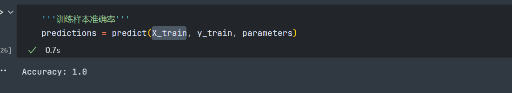
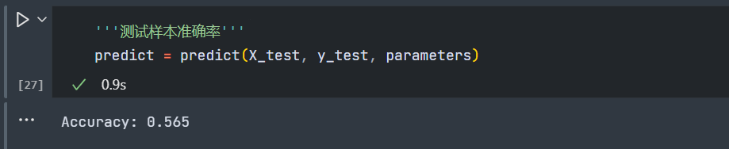

### 

先来看一下未优化的效果，2000次普通网络cost 打印:

2000次普通网络cost 学习图：

2000次普通网络训练样本准确率 1.0 ：

2000次普通网络测试样本准确率 0.58，这里准确率很低，是过拟合：

### 采用L2正则化+Adam优化

2000次 L2 + adam优化cost 打印：

2000次 L2 + adam优化cost 学习图：

2000次 L2 + adam优化训练样本准确率 :

2000次 L2 + adam优化测试样本准确率：

### 采用Dropout+Adam优化

3000 dropout+adam优化:

3000 dropout+adam优化cost学习图 :

3000 dropout+adam优化训练样本正确率 :

3000 dropout+adam优化 测试样本准确率:

优化效果不是很明显...
